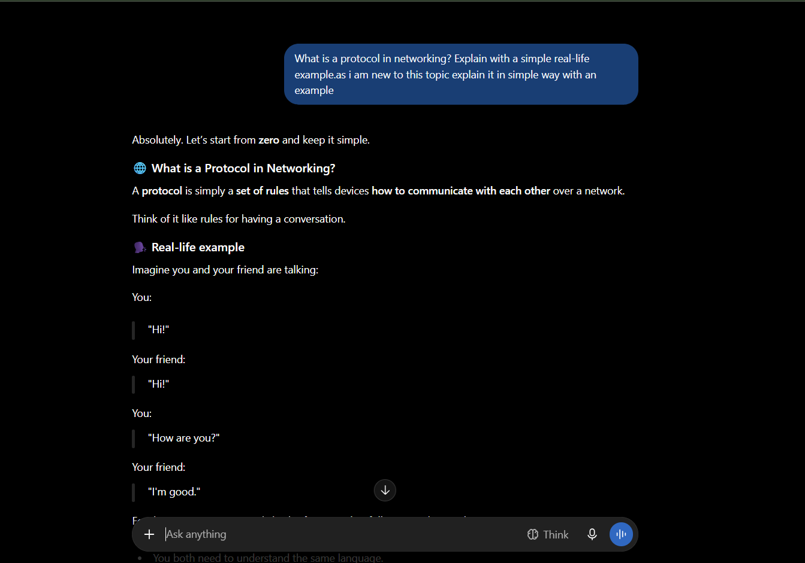
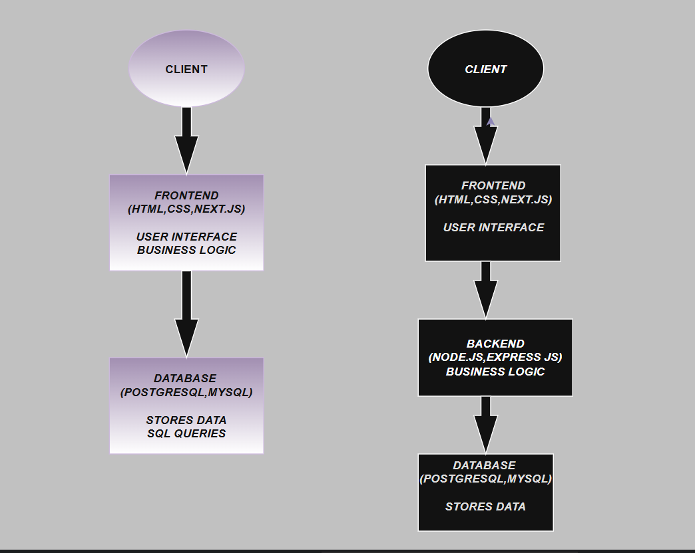
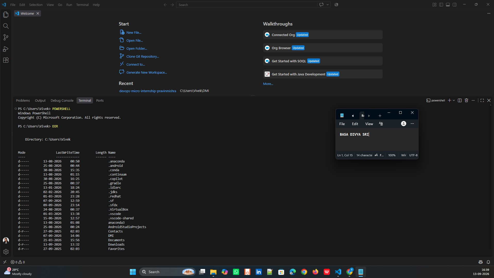

# Week 00 - Internet and Networking

Part of the DevOps Micro Internship (DMI) Cohort 3 with Agentic AI

---

# 🧑‍💻 Task 1: Using ChatGPT as Your Learning Assistant

## Scenario

You're new to DevOps and will frequently encounter technical questions. ChatGPT can be your learning companion.

## Your Task

Write a clear ChatGPT prompt to help you understand:

> "What is a protocol in networking? Explain with a simple real-life example."

Take a screenshot of your interaction showing:

* Your detailed prompt (with clear expectations)
* ChatGPT's simplified response with an example

## Screenshot

Save your screenshot in the `screenshots` folder and update the file name below.




Replace `task-1-chatgpt.png` with your actual screenshot file name.

---

## What I Learned (2–3 lines)

The communication between devices in a network follows a set of rules called protocols. These protocols help devices communicate, send and receive data correctly, and identify where the data should go. Different protocols such as HTTP, HTTPS, IP, TCP, and DNS are used for different networking purposes.

---

# 🌐 Task 2: Internet and Networking

## Scenario

Your friend is launching an online bookstore named **EpicReads**.

He asked you to explain how users globally can access his website hosted in Finland.

## Your Task

Write a short explanation (**100–150 words**) that includes:

* Packet Switching
* IP Address
* TCP/IP
* HTTP/HTTPS

💡 **Tip:** You may use ChatGPT (as demonstrated in Task 1) to refine your explanation.

## Answer

When a user from any country opens the EpicReads website hosted in Finland, the data travels across the Internet using several networking concepts.

Packet Switching: The user's request is divided into small packets. These packets travel through different network paths and are reassembled when they reach the EpicReads server.

IP Address: Every device and server has an IP address that helps identify where data should be sent. The user's request is directed to the IP address of the EpicReads server in Finland.

TCP/IP: IP handles addressing and routing the packets, while TCP helps ensure that the packets reach the destination correctly and in the proper order.

HTTP/HTTPS: HTTP is used for communication between the browser and website server. HTTPS is the secure version that encrypts the communication, helping protect user data such as login details.

This process allows users globally to access EpicReads even though its server is hosted in Finland.

---

# 🏗️ Task 3: Application Architecture & Stack

## Scenario

EpicReads bookstore has two application versions:

### Two-Tier Application

* Frontend
* Database

### Three-Tier Application

* Frontend
* Backend
* Database

## Your Task

* Draw simple diagrams (hand-drawn or tool-based such as draw.io)
* Label each layer clearly
* List at least two common technologies or tools used for each layer
* Submit a screenshot or photo clearly showing your own drawing

## Diagram Screenshot / Photo

Save your diagram image in the `screenshots` folder and update the file name below.




Replace `task-3-diagram.png` with your actual diagram file name.

---

## Technologies Used

### Frontend

* HTML
* CSS
* JAVASCRIPT
* TAILWIND CSS
* REACT CONTEXT API

### Backend

* NODE.JS & EXPRESS.JS
* MYSQL & SEQUELIZE
* JWT
* BCRYPT.JS
* CORS

### Database

* MySQL
* PostgreSQL
* MongoDB
* Oracle Database
* Microsoft SQL Server
---

# 🌍 Task 4: Domain Name & DNS (Basic Concepts)

## Scenario

Your friend's bookstore **EpicReads** is currently accessible through:

```text
52.172.142.222:3000
```

He purchased the domain:

```text
epicreads.com
```

## Your Task

In **50–100 words**, explain in your own words:

1. What is DNS (Domain Name System)?
2. Which DNS record type should be used to connect the domain to the given IP, and why?

## Answer

DNS (Domain Name System) is a system that converts human-readable domain names into IP addresses. It helps users access websites using easy-to-remember names instead of numerical IP addresses.

For epicreads.com, an A record should be used to connect the domain to 52.172.142.222. An A record maps a domain name to an IPv4 address. Since 52.172.142.222 is an IPv4 address, the A record is the correct DNS record type. When a user enters epicreads.com, DNS finds this IP address and directs the request to the server.

---

# 💻 Task 5: Visual Studio Code Setup (Hands-on)

## Your Task

Install Visual Studio Code (if not already installed).

Take a screenshot of your VS Code environment showing:

* Terminal open inside VS Code
* Running a basic command:

### Windows

```powershell
dir
```

### Linux / macOS

```bash
pwd
ls
```

* Your selected VS Code theme clearly visible

⚠️ **Important:** The screenshot must show your username or another identifiable detail to confirm it is your environment.

## Screenshot

Save your screenshot in the `screenshots` folder and update the file name below.




Replace `task-5-vscode.png` with your actual screenshot file name.

---

# 🔗 Task 6: Publish Your Assignment as a LinkedIn Post

## Objective

Publishing on LinkedIn helps you:

* Build your professional online presence
* Reinforce your learning
* Document your DevOps journey publicly

## Your Task

Summarize your answers from Tasks 1–5 into a LinkedIn post.

Clearly structure your post into the following sections:

* ChatGPT
* Internet & Networking
* App Architecture
* DNS
* VS Code Setup

Use the credit note that matches your track:

Add the following credit note at the end of your post **(If you are DMI Cohort 3 student)**:

> **P.S. This post is part of the DevOps Micro Internship (DMI) with Agentic AI — Cohort 3 — by Pravin Mishra. My graded progress is public: https://dmi.pravinmishra.com/s/YOUR-GITHUB-USERNAME.html · Start your DevOps journey: https://dmi.pravinmishra.com/?utm_source=student&utm_medium=ps-linkedin&utm_campaign=cohort3**

**Tag [Pravin Mishra](https://www.linkedin.com/in/pravin-mishra-aws-trainer/) in your LinkedIn post, then tag Lead Co-Mentor — [Anjana Muthunayake](https://www.linkedin.com/in/anjana-muthunayake/).**

Add the following credit note at the end of your post **(If you are DMI Self-paced track student)**:

> **P.S. This post is part of the DevOps Micro Internship (DMI) — Self-Paced Engineer Track — by Pravin Mishra. My graded progress is public: https://dmi.pravinmishra.com/s/YOUR-GITHUB-USERNAME.html · Start your DevOps journey: https://dmi.pravinmishra.com/?utm_source=student&utm_medium=ps-linkedin&utm_campaign=self-paced**

Add the following credit note at the end of your post **(If you are DMI Campus student)**:

> **P.S. This post is part of the DevOps Micro Internship (DMI) — Campus — by Pravin Mishra. My graded progress is public: https://dmi.pravinmishra.com/s/YOUR-GITHUB-USERNAME.html · Start your DevOps journey: https://dmi.pravinmishra.com/?utm_source=student&utm_medium=ps-linkedin&utm_campaign=campus**

**Tag [Pravin Mishra](https://www.linkedin.com/in/pravin-mishra-aws-trainer/) in your LinkedIn post, then tag Lead Co-Mentor — [Anjana Muthunayake](https://www.linkedin.com/in/anjana-muthunayake/).**

Hashtags:

#DMIByPravinMishra #AgenticAI #DevOps

Replace `YOUR-GITHUB-USERNAME` with your GitHub username — that link is your public DMI progress page (your graded badge page).
---

## LinkedIn Post URL

Paste your LinkedIn post URL here:

https://lnkd.in/p/ds5QX4gM

---

## LinkedIn Post Backup Copy

Paste the full text of your LinkedIn post here:

Week 0 of my DevOps Micro Internship (DMI) Campus Program — Agentic AI

I’ve started my DevOps journey with the fundamentals of Internet, Networking, and application architecture. Here’s what I learned this week:  

ChatGPT I learned how to use ChatGPT as a learning assistant to understand technical concepts in a simple way. I explored networking protocols using real-life examples.  

Internet & Networking I learned how data travels across the Internet using packet switching, IP addresses, TCP/IP, and HTTP/HTTPS. I also understood how a website hosted in one country can be accessed by users globally.  

App Architecture I learned the difference between 2-tier and 3-tier architecture. • 2-tier: Frontend → Database • 3-tier: Frontend → Backend → Database I also explored technologies such as HTML, CSS, JavaScript, Node.js, Express.js, and MySQL. 

DNS I learned how DNS converts a human-readable domain name into an IP address and how an A record can connect a domain to an IPv4 address. 

VS Code Setup I practiced using the VS Code integrated terminal and basic commands in PowerShell. Overall, Week 0 helped me understand the basic building blocks behind how applications communicate and work over the Internet. Looking forward to learning and building more in the coming weeks!

P.S. This post is part of the DevOps Micro Internship (DMI) — Campus — by Pravin Mishra. My graded progress is public:  https://dmi.pravinmishra.com/s/sridivya44.html  · Start your DevOps journey: https://dmi.pravinmishra.com/?utm_source=student&utm_medium=ps-linkedin&utm_campaign=campus
#DMIByPravinMishra

Pravin Mishra
Anjana Muthunayake

---

# Reflection – Week 0

### What did you find easy?

I found learning basic networking concepts and using ChatGPT to understand technical topics easy.

---

### What was difficult?

How DNS connects a domain to an IP address was a little difficult.

---

### What will you improve next week?

I will improve my networking knowledge, coding skills, and hands-on DevOps practice.

---

## 📌 About DMI & CloudAdvisory

DevOps Micro Internship (DMI) is a project-based DevOps program run by Pravin Mishra (The CloudAdvisory) focused on real-world execution, systems thinking, and career readiness.

It helps learners build strong DevOps foundations with hands-on experience.


## 📌 Resources

- 🌐 **DMI Official Website:** https://dmi.pravinmishra.com?utm_source=github&utm_medium=readme  
- 🎓 **University:** https://university.pravinmishra.com?utm_source=github&utm_medium=readme  
- 💬 **Discord Community:** https://discord.pravinmishra.com?utm_source=github&utm_medium=readme  
- 📝 **Blog:** https://dmi.pravinmishra.com/blog?utm_source=github&utm_medium=readme  
- ▶️ **YouTube Playlist (DMI Cohort 3):** https://www.youtube.com/playlist?list=PLFeSNDtI4Cho  
- 🔗 **Pravin Mishra (LinkedIn):** https://www.linkedin.com/in/pravin-mishra-aws-trainer/  
- 🏢 **CloudAdvisory (LinkedIn):** https://www.linkedin.com/company/thecloudadvisory/

---

*This submission is part of DevOps Micro Internship (DMI) Cohort 3 — Agentic AI Track*